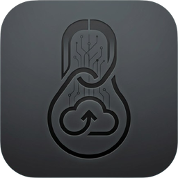
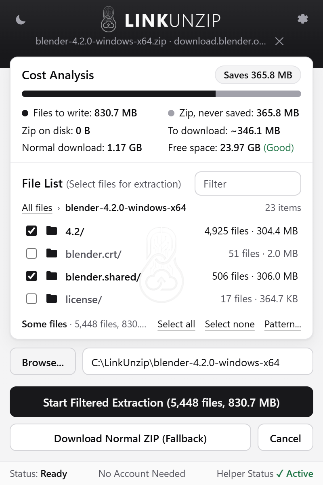
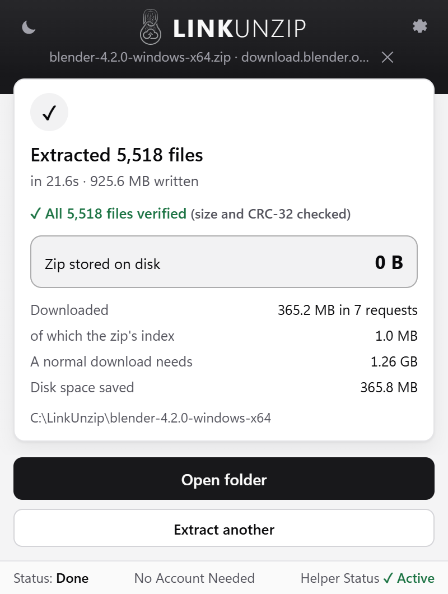

<p align="center">
  
</p>

<h1 align="center">LinkUnzip</h1>

<p align="center">
  <b>Extract a ZIP straight from a link into a folder, without ever saving the ZIP.</b><br>
  A browser extension for Chrome, Edge and Brave, with a small free helper program for Windows.
</p>

<p align="center">
  <a href="https://github.com/CincaAlex/LinkUnzip/actions/workflows/ci.yml"></a>
  <a href="https://github.com/CincaAlex/LinkUnzip/releases/latest"></a>
  <a href="LICENSE"></a>
  
</p>

<p align="center">
  <a href="https://linkunzip.app">Website</a> |
  <a href="#install">Install</a> |
  <a href="#how-to-use-it">How to use it</a> |
  <a href="#faq">FAQ</a> |
  <a href="docs/privacy.md">Privacy</a>
</p>

<p align="center">
  <picture>
    <source media="(prefers-color-scheme: dark)" srcset="docs/images/popup-choose-dark.png">
    
  </picture>
  &nbsp;&nbsp;
  <picture>
    <source media="(prefers-color-scheme: dark)" srcset="docs/images/popup-done-dark.png">
    
  </picture>
</p>

## Why

To unpack a zip from the internet you normally download all of it first, so your disk needs room
for the zip *and* the files, and you wait for the whole archive even when you only need one folder.

LinkUnzip reads the zip's index from the end of the file, shows you what is inside and what it will
cost, then downloads only the parts it needs and writes the files straight into a folder. The zip
itself is never saved.

Measured on the developer's PC:

| Archive | Result |
|---|---|
| Blender 4.2 for Windows (365.8 MB zip, 5,518 files) | 925.6 MB written, 365.2 MB downloaded (including the 1.0 MB index), 0 B of zip on disk, every file verified, in 15 to 22 s. A normal download-then-extract needs 1.26 GB. |
| One photo out of COCO train2017 (18.01 GB zip, 118,287 files) | 12.2 MB downloaded (the 11.9 MB index and the 219 KB photo), in 4 to 7 s. |
| A GitHub "Download ZIP" archive (stream mode) | 1,562 files, 35.1 MB written from 13.1 MB read in one pass. |

Sizes are shown the way Windows shows them (1 GB = 1024 MB).

## Features

- **See the cost first.** Before anything is written, the *Cost Analysis* shows what LinkUnzip will
  write, what a normal download-then-extract would need, and the free space on your drive.
- **Take only what you need.** Tick files and folders in the *File List*, or search every name with
  *Filter*. Files you leave out are never downloaded.
- **Every file checked.** Each file is written under a temporary name, checked (size and CRC-32) and
  only then given its real name.
- **Fast.** Several connections at once (4 by default, up to 16).
- **Resume.** Stopped halfway, or the network dropped? Resume skips the files that are already done.
- **Works with GitHub's "Download ZIP"** and other servers that can only send a file from start to
  end: *Stream it anyway* reads it in one pass, still without saving the zip.
- **Big archives.** ZIP64, flat memory use, no 2 GB limit.
- **Private links.** If a download needs your login, LinkUnzip asks for that one site first.
- **Light and dark**, following Windows or your choice.
- **No account, no ads, no uploads, no tracking.**

## Install

LinkUnzip has two parts: the browser extension, and a small helper program that does the
downloading and writing ([why?](#why-is-there-a-helper-program)). The extension installs the
helper for you.

### 1. Add the extension

Add LinkUnzip from the [Chrome Web Store](https://chromewebstore.google.com/detail/dapeiljhjlaelolngnoagobeojcpkica). Edge, Brave and Chromium can
install it from there too (in Edge, click **Allow extensions from other stores** when it asks).
The Edge Add-ons listing will follow. You can also [run it from source](#build-from-source).

### 2. Install the helper

After you add the extension, a **Set up LinkUnzip** page opens by itself:

1. Click **Download linkunzip-setup.exe**.
2. Click **Open the installer**, then **Install**.
3. The page turns green as soon as the helper answers. That's it.

Windows may say *Windows protected your PC*, because the installer is new and not signed yet: click
**More info**, then **Run anyway** (see the [FAQ](#windows-warns-about-the-installer-is-that-normal)).

You can also download the installer yourself:
[`linkunzip-setup.exe`](https://github.com/CincaAlex/LinkUnzip/releases/latest/download/linkunzip-setup.exe)
from the [latest release](https://github.com/CincaAlex/LinkUnzip/releases/latest), where
`SHA256SUMS.txt` lets you check it.

The installer:

- installs for your Windows user only, without administrator rights, into
  `%LOCALAPPDATA%\Programs\LinkUnzip`;
- registers the helper with Chrome, Edge, Brave and Chromium;
- appears in *Settings > Apps > Installed apps*;
- updates the helper in place when you run a newer one (the extension tells you when it needs one).

For scripts: `linkunzip-setup.exe /VERYSILENT /SUPPRESSMSGBOXES`.

**Requirements:** Windows 10 or 11 (64-bit), and Chrome 116 or newer, Edge, Brave or Chromium.

### Uninstall

1. Remove the extension: open `chrome://extensions` (or `edge://extensions`), then **Remove** on
   LinkUnzip.
2. Remove the helper: *Settings > Apps > Installed apps > LinkUnzip > Uninstall*.

Files you extracted stay where you put them.

## How to use it

1. **Right-click a link** to a `.zip` and choose **Extract with LinkUnzip**. Or click the LinkUnzip
   icon in the toolbar and paste a link; the popup also lists the zip links on the page you are on.
2. LinkUnzip reads the zip's index and shows the **Cost Analysis** and the **File List**. Untick what
   you don't need, and pick a folder with **Browse...**.
3. Click **Start Extraction**. You can close the popup: the toolbar icon shows the progress, and a
   notification tells you when it is done. Click it, or **Open folder**, to see your files.

Also good to know:

- **Stop** keeps the files that are finished; **Resume** carries on into the same folder.
- **Download Normal ZIP (Fallback)** hands the link back to your browser if you'd rather have the zip.
- **Pattern...** under the File List takes a filter such as `*.dll, docs/*`.
- **Settings** (gear icon): light or dark theme, the base folder, parallel connections (1 to 16),
  the login options, and *Catch .zip downloads*, which offers LinkUnzip whenever the browser starts
  downloading a zip (off by default).

## What it doesn't do (yet)

- Password-protected zips, and compression other than the two common methods (stored and deflate).
  LinkUnzip names the files it can't extract instead of failing silently. Both are planned.
- RAR or 7z from a link, or creating archives.
- Downloads that only exist inside a web page (`blob:` links, like WhatsApp Web), or links that need
  a form POST or a one-time token.
- macOS and Linux (planned later).

The extracted files still need their disk space; what LinkUnzip saves is the room the zip would
take.

## Privacy

No accounts, no analytics, no servers of ours. The extension talks only to the helper on your PC,
and the helper connects only to the server of the link you chose. Your browser login for a site is
used only if you allow it for that site, and goes only to that site.
Full policy: [docs/privacy.md](docs/privacy.md).

## FAQ

### Why is there a helper program?

A browser extension can't write thousands of files into a folder of your choice, or keep a
multi-gigabyte download going on its own. A small program on your PC can. The extension talks to it
through the browser's *native messaging*. The helper only runs while you use LinkUnzip and closes
30 seconds after the last activity.

### Why Windows only?

The helper is written for Windows first. macOS and Linux helpers are planned.

### Windows warns about the installer. Is that normal?

Yes, for now. The installer is not code-signed yet, so SmartScreen may say *Windows protected your
PC* or *Unknown publisher*, and the browser may say the file isn't commonly downloaded. To run it:
**More info**, then **Run anyway**. To check that your copy is the published one, compare its
SHA-256 with `SHA256SUMS.txt` on the release page:

```powershell
Get-FileHash .\linkunzip-setup.exe -Algorithm SHA256
```

Signed installers are planned. Even signed, a new installer can trigger SmartScreen until enough
people have downloaded it.

### Does it work with private links?

Yes, when the site logs you in with cookies (most do): LinkUnzip asks once per site to use your
login there. Signed links from cloud storage work while they are valid; if one has expired, get a
fresh link from the page.

### Does it work with every server?

The full experience (cost preview, choosing files, parallel connections) needs a server that can
send parts of a file (HTTP Range requests). Most download servers, CDNs and cloud storage can. For
the others there is *Stream it anyway*.

### Is it safe to extract a zip I don't trust?

LinkUnzip treats every archive as untrusted. It refuses paths that would escape the folder (`..`,
absolute paths, drive letters) before anything is written, renames names Windows can't store and
says so, never writes more than a file's declared size, and gives a file its real name only after
its size and CRC-32 check out.

### Does it save disk space for the extracted files too?

No. The files you extract take the same space as always. LinkUnzip saves the space of the zip
itself, and the download of everything you leave out.

## Command line

`linkunzip.exe` is also a command-line tool (the installer puts it in
`%LOCALAPPDATA%\Programs\LinkUnzip`):

```powershell
linkunzip inspect https://example.com/big.zip                    # what would extracting need?
linkunzip extract https://example.com/big.zip -o D:\out --include "*.csv" --jobs 8
linkunzip extract https://github.com/user/repo/archive/refs/heads/main.zip -o D:\out --stream
```

| Command | What it does |
|---|---|
| `inspect <URL>` | Reads the index and prints the file count, sizes, free space and the download-then-extract comparison. `--list` also lists every entry; `-o <DIR>` picks the drive for the free-space check. |
| `extract <URL> -o <DIR>` | Extracts into `<DIR>`. `--include <GLOB>` (repeatable) takes only matching entries, and skipped entries are not downloaded. `--jobs <N>` sets parallel connections (1 to 64, default 4). `--stream` reads the file once from start to end, for servers without Range support. `--overwrite` extracts every file again instead of skipping the ones already there. `--force` goes ahead even if the free-space check says the files won't fit. |
| `host install` / `uninstall` / `status` | Registers the helper for Chrome, Edge, Brave and Chromium without the installer, removes that, or shows where it is registered. |

The exit code is 0 on success and 1 on any error. Errors read as a sentence, with the technical
cause and a hint on what to try next.

## How it works

A ZIP keeps its index (the *central directory*) at the **end** of the file.

1. **Probe:** a one-byte Range request tells LinkUnzip the size and whether the server can send
   parts of the file.
2. **Index:** it fetches the last ~64 KB, finds the end-of-central-directory record (and the ZIP64
   one), then the whole central directory in one request.
3. **Plan:** it checks every selected entry (paths, compression methods, overlaps) and the free
   space, then groups neighbouring entries into a few spans, so files you skipped are not downloaded.
4. **Extract:** each connection makes one Range request per span and walks its entries: local
   header, then the data through a deflate decoder into `<name>.part` while computing the CRC-32,
   then a size and CRC check and the rename to the real name.
5. **Retries:** a network error restarts only the current file, with backoff. Finished files are
   never fetched again.

Without Range support (`--stream`), LinkUnzip reads the archive once from start to end and extracts
each entry as it arrives, including entries whose sizes only follow their data.

**Limits:** stored and deflate entries only; no encryption, multi-disk archives, self-extractors,
timestamps or permissions; symbolic links are written as small text files. One big file uses one
connection, and a retry restarts that file.

## Build from source

You need Windows 10 or 11, [Rust](https://rustup.rs) (stable), Python 3, and
[Inno Setup 6](https://jrsoftware.org/isinfo.php) for the installer
(`winget install JRSoftware.InnoSetup`).

```powershell
git clone https://github.com/CincaAlex/LinkUnzip.git
cd LinkUnzip
python tools\package.py      # builds linkunzip.exe, the installer and the store zip into dist\
dist\linkunzip-setup.exe     # installs the helper you just built
```

Then load the extension: open `chrome://extensions`, turn on **Developer mode**, click
**Load unpacked** and choose the `extension` folder. It keeps a fixed development ID, which is the
one the helper you built accepts.

Tests, the browser end-to-end test and the project layout are in
[CONTRIBUTING.md](CONTRIBUTING.md).

## Contributing

Bug reports, ideas and pull requests are welcome: see [CONTRIBUTING.md](CONTRIBUTING.md). For a
security problem, please report it privately as described in [SECURITY.md](SECURITY.md). What
changed in each version is in [CHANGELOG.md](CHANGELOG.md).

## Licence

LinkUnzip is free software: you can redistribute it and/or modify it under the terms of the
[GNU General Public License](LICENSE) as published by the Free Software Foundation, either version 3
of the License, or (at your option) any later version. It comes with no warranty.
